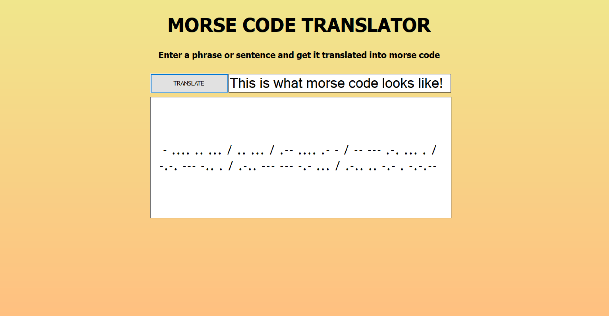

# Morse-Code-Translator

 An application that takes in a phrase from the user and translates it into Morse code.
      

## Table of Contents
- [About](#about)
- [Getting Started](#getting_started)
- [How to Use](#usage)
- [Authors](#authors)
## About 
This program was created in order to display and improve my skills in C# and my skills in producing a windows application that uses multiple files. This program was created over the span of two days.

## Getting Started 
What you will need to run this program: 
- <em>C# IDE</em>- In order to use and/or manipulate the code of this app, you will need some sort of C# IDE. The IDE I used for this app was SharpDevelop, but others such as Visual Studio would also work.
## How to Use 
After installing and adding everything necessary, all you need to do is run the program, enter the phrase that you want translated, and then click the TRANSLATE button in order to get that phrase in morse code.
## Author 
[@AlexHettle](https://github.com/AlexHettle) - Sole author of project
